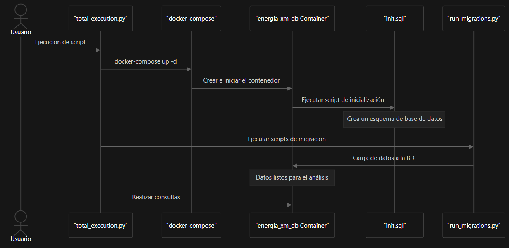

# Proyecto de Base de Datos Energética

Este proyecto tiene como objetivo diseñar e implementar una base de datos relacional para gestionar métricas energéticas de un sistema de monitoreo. La base de datos se implementa utilizando PostgreSQL dentro del contenedor Docker.
Este documento ofrece una introducción completa al Sistema de Base de Datos Energia XM, un proyecto diseñado para gestionar y analizar métricas energéticas mediante PostgreSQL en contenedores Docker. El sistema permite el seguimiento y análisis eficaz de la demanda, la generación y la capacidad energética en diferentes sistemas y recursos energéticos.

## Descripción general del sistema
El sistema Energia XM consta de varios componentes integrados que trabajan juntos para crear, completar y mantener una base de datos PostgreSQL para métricas de energía.


## Arquitectura de base de datos
La base de datos está diseñada con un esquema normalizado optimizado para datos de energía de series temporales, utilizando particiones de tablas para mejorar el rendimiento.


## Flujo de Ejecución
El sistema sigue un flujo de ejecución definido para configurar y completar la base de datos:




## Estructura del Proyecto

El proyecto está hecho por los siguientes archivos:

```bash
def_proyecto_energia_xm/
  ├── backup_postgres/...
  ├── diagrams/ 
  │   └── diagram_1.png
  │   └── diagram_2.png
  │   └── diagram_3.png
  │   └── diagrama_energia_xm.png
  ├── migration/ 
  │   └── d_migration_Recursos.py
  │   └── d_migration_DemaSIN.py
  │   └── d_migration_DR_DC_G.py
  │   └── d_migration_CapEfecNeta.py
  │   └── metricas.xlsx
  ├── docker-compose.yml
  ├── Dockerfile
  ├── init.sql 
  ├── pg_hba.conf
  ├── postgresql.conf
  ├── README.md
  ├── requirements.txt
  ├── run_migrations.py
  ├── test_conn.py.py
  ├── total_execution.py
```
- **/backup_potgres**:  Esta carpeta posee todo el backup del volúmen de datos migrados a la base de datos como una forma opcional de reingresar los datos a la base de datos del contenedor sin necesidad de ejecutar ```run_migrations.py```.
- **/diagrams**:  Dicha carpeta contiene todas las imágenes de los diagramas del proyecto como especificación de su ejecución y funcionamiento.
- **/migration**:  Tenemos la carpeta de migración la cual conlleva 5 archivos, 4 de ellos archivos python que tienen los script de migración ```d_migration....py``` y 1 de ellos el cual representa las métricas que fueron utilizadas para dicho proyecto ```metricas.xlsx```.
- **docker-compose.yml**: Este archivo es la contrucción para la creación y la configuración del contenedor en PostgreSQL.
- **Dockerfile**: Este archivo es usado para personalizar la imagen de PostgreSQL.
- **init.sql**: Este es el Script SQL para crear las tablas, índices y restricciones necesarias en la base de datos ```energia_xm```.
- **pg_hba.conf**: Archivo como configuración de acceso a PostgreSQL.
- **postgresql.conf**: Archivo usado como la configuración personalizada de PostgreSQL.
- **README.md**: Este dicho archivo es el que contiene instrucciones del uso al proyecto.
- **requirements.txt**: Este archivo es el que contiene todas las dependencias necesarias para los archivos .py que hay en el proyecto y para su correcta ejecución.
- **run_migrations.py**: Este archivo python es el archivo principal del cual se hace la migración definiendo así la ejecución de los demás archivos ubicados en la carpeta ```migration/d_migration....py```.
- **test_conn.py**: Este archivo python fue creado para verificar la correcta conexión con la base de datos creada en ```docker-compose.yml```.
- **total_execution.py**: Este archivo python es el **ejecutable principal** para que se inicie el proyecto.
Sus comaandos utilizados en el archivo son:
1. Inicialización del proyecto y la construcción de su contenedor.
```bash
docker-compose up -d
```
2. Para que se instalen las dependencias necesarias de los archivos python que se encuentran en el proyecto con su comando:
```bash
python -m pip install -r requirements.txt
```
3. Y para que se haga la total migración de datos por medio del archivo ```run_migrations.py``` con su comando:
```bash
python run_migrations.py
```

## Requisitos

- Docker y Docker Compose instalados en tu sistema.
- Acceso a la terminal o consola de comandos.
- Uso del sistema de gestión de bases de datos relacional orientado a objetos y de código abierto PostgreSQL 

## Instrucciones de Uso

### Paso 1: Iniciar Docker

Primero debemos asegurarnos de que Docker Desktop si se inició y se ejecutó correctamente. Si usas **Docker Desktop**, abre la aplicación y verifica que esté ejecutandose.

### Paso 2: Descargar proyecto

Descarga y/o copia el proyecto en tu máquina.

```bash
git clone https://github.com/JeanP09/def_proyecto_energia_xm.git
cd def_proyecto_energia_xm
```


### Paso 3: Iniciar los servicios definidos

Dentro de la carpeta del proyecto, dirígete al archivo ```run_migrations.py```, esto hará que:
1. Se **iniciará** los servicios ya definidos en el archivo `docker-compose.yml` como segundo plano, con su comando:
```bash
docker-compose up -d
```

2. Instalará las dependencias necesarias para de los archivos python que se encuentran en el proyecto con su comando:
```bash
python -m pip install -r requirements.txt
```

3. Se ejecutará el archivo ```run_migrations.py``` para que se haga la total migración de datos con su comando:

```bash
python run_migrations.py
```

### Paso 4: Acceder a la Base de Datos
Una vez que el todo esto se haya ejecutado, podemos acceder a la base de datos ejecutando el siguiente comando:

```bash
docker exec -it energia_xm_db psql -U admin -d energia_xm
```
Esto abrirá una sesión de PostgreSQL dentro del contenedor donde podremos ejecutar comandos SQL.

### Paso 5: Inicializar la Base de Datos
El script ```init.sql``` se ejecuta automáticamente al levantar el contenedor y crea las tablas necesarias, índices y restricciones. No es necesario ejecutar ninguna acción adicional para poblar la base de datos.

**Sin embargo**, tenemos la carpeta ```backup_postgres/``` la cual contiene todos los archivos físicos de la base de datos PostgreSQL como volúmenes que pueden ser resturados, para evitar la migración de datos por medio de Python, la cual es muy demorada debido al gran volúmen de datos que contienen las indexaciones por la consula de la API de XM.

### ¿Cómo resturar el volúmen de datos sin hacer la migración?


1. **Verificar donde se encuentra la carpeta de respaldo `backup_postgres`**

En este caso ya se encuentra dentro del directorio original del proyecto:

```
def_proyecto_energia_xm/
├── backup_postgres/ <-- Carpeta de respaldo
├── migration/
├── docker-compose.yml
├── run_migrations.py
├── requirements.txt
└── ...
```
```
Si ves la carpeta `backup_postgres` como en el ejemplo anterior, ya puedes continuar con la restauración del volumen a Docker.
```
2. **Crea el volumen vacío en Docker con el mismo nombre:**

```bash
docker volume create def_proyecto_energia_xm_postgres_data
```

3. **Restaura los archivos al volumen:**

```bash
docker run --rm \
  -v def_proyecto_energia_xm_postgres_data:/to \
  -v $(pwd)/backup_postgres:/from \
  alpine \
  sh -c "cd /from && cp -a . /to"
```

4. **Levanta tu entorno normalmente:**

```bash
docker-compose up -d
```

---

Y listo, el proyecto ahora funcionará en otra máquina sin necesidad de volver a indexar los datos con correr los archivos de la carpeta ```migration/d_migration_...py```.

### Paso 6: Verificar el estado
Puedes verificar que todo esté funcionando correctamente revisando los logs del contenedor con el siguiente comando:
```bash
docker logs energia_xm_db
```

### Paso 7: Ejecución de las cinco consultas de base de datos que evidencian la capacidad del modelo para resolver el problema planteado.
(*4. ¿Cómo se interrelacionan Demanda_Energética, Capacidad_Instalada, Índice_Servicio y Tiempo_Respuesta_Demanda para implementar mejoras que garanticen un servicio eficiente y disminuyan en un 20% los tiempos de respuesta en 9 meses?*)

Tenemos las siguientes consultas que son:

**Consulta 1: Comparación entre demanda real y generación horaria por sistema**

```sql
SELECT 
    dd.fecha,
    dd.hora,
    s.nombre AS sistema,
    dd.valor AS demanda_kwh,
    gh.valor AS generacion_kwh,
    (gh.valor - dd.valor) AS diferencia_kwh
FROM 
    Demanda_Diaria dd
JOIN Generacion_Horaria gh ON dd.fecha = gh.fecha AND dd.hora = gh.hora AND dd.id_sistema = gh.id_sistema
JOIN Sistema s ON dd.id_sistema = s.id_sistema
JOIN Metrica md ON dd.id_metrica = md.id_metrica
JOIN Metrica mg ON gh.id_metrica = mg.id_metrica
WHERE md.metric_id = 'DemaReal' AND mg.metric_id = 'Gene'
ORDER BY dd.fecha, dd.hora;
```

**Consulta 2: Análisis del índice de cobertura por día**


```sql
SELECT 
    dd.fecha,
    s.nombre AS sistema,
    ROUND(SUM(CASE WHEN gh.valor >= dd.valor THEN 1 ELSE 0 END)::DECIMAL / COUNT(*) * 100, 2) AS indice_cobertura_porcentual
FROM 
    Demanda_Diaria dd
JOIN Generacion_Horaria gh ON dd.fecha = gh.fecha AND dd.hora = gh.hora AND dd.id_sistema = gh.id_sistema
JOIN Sistema s ON dd.id_sistema = s.id_sistema
JOIN Metrica md ON dd.id_metrica = md.id_metrica
JOIN Metrica mg ON gh.id_metrica = mg.id_metrica
WHERE md.metric_id = 'DemaReal' AND mg.metric_id = 'Gene'
GROUP BY dd.fecha, s.nombre
ORDER BY dd.fecha;
```

**Consulta 3: Capacidad instalada vs demanda máxima diaria por recurso**


```sql
SELECT 
    r.nombre AS recurso,
    dd.fecha,
    MAX(dd.valor) AS demanda_max_kwh,
    cd.valor AS capacidad_kwh,
    (cd.valor - MAX(dd.valor)) AS margen_kwh
FROM 
    Capacidad_Diaria cd
JOIN Recurso r ON cd.id_recurso = r.id_recurso
JOIN Metrica mcd ON cd.id_metrica = mcd.id_metrica
JOIN Demanda_Diaria dd ON dd.fecha = cd.fecha
JOIN Metrica mdd ON dd.id_metrica = mdd.id_metrica
WHERE mcd.metric_id = 'CapEfecNeta' AND mdd.metric_id = 'DemaReal'
GROUP BY r.nombre, dd.fecha, cd.valor
ORDER BY dd.fecha;
```

**Consulta 4: Identificación de horas críticas por sistema (desfase máximo)**


```sql
SELECT 
    dd.fecha,
    dd.hora,
    s.nombre AS sistema,
    dd.valor AS demanda_kwh,
    gh.valor AS generacion_kwh,
    ABS(gh.valor - dd.valor) AS desfase_kwh
FROM 
    Demanda_Diaria dd
JOIN Generacion_Horaria gh ON dd.fecha = gh.fecha AND dd.hora = gh.hora AND dd.id_sistema = gh.id_sistema
JOIN Sistema s ON dd.id_sistema = s.id_sistema
JOIN Metrica md ON dd.id_metrica = md.id_metrica
JOIN Metrica mg ON gh.id_metrica = mg.id_metrica
WHERE md.metric_id = 'DemaReal' AND mg.metric_id = 'Gene'
ORDER BY desfase_kwh DESC
LIMIT 10;
```

**Consulta 5: Tendencia del índice de servicio mensual (para cumplir meta de 9 meses)**


```sql
SELECT 
    DATE_TRUNC('month', dd.fecha) AS mes,
    ROUND(SUM(CASE WHEN gh.valor >= dd.valor THEN 1 ELSE 0 END)::DECIMAL / COUNT(*) * 100, 2) AS indice_servicio_mensual
FROM 
    Demanda_Diaria dd
JOIN Generacion_Horaria gh ON dd.fecha = gh.fecha AND dd.hora = gh.hora AND dd.id_sistema = gh.id_sistema
JOIN Metrica md ON dd.id_metrica = md.id_metrica
JOIN Metrica mg ON gh.id_metrica = mg.id_metrica
WHERE md.metric_id = 'DemaReal' AND mg.metric_id = 'Gene'
GROUP BY DATE_TRUNC('month', dd.fecha)
ORDER BY mes;
```
<br>

### Consideraciones Adicionales
1. **Configuración de PostgreSQL**: No se requiere ninguna configuración especial para PostgreSQL, incluso la ejecución del script init.sql automáticamente hace crear las tablas dentro de la base de datos ```energia_xm```.

2. **Métricas y API Externas**: No se requiere configuración adicional para métricas ni API externas en esta fase del proyecto, los archivos python ```d_migration....py``` ya contienen sus intrucciones para hacer la consulta con sus objetos de JSON.

3. **Sistema Operativo**: Los comandos de Docker y los scripts son compatibles con sistemas operativos como Windows, macOS y Linux. Las rutas pueden ser diferente, por lo que el proyecto debería funcionar independientemente del sistema operativo.

### Justificación del Modelo Relacional
El modelo relacional está diseñado para manejar las métricas energéticas de manera eficiente, permitiendo consultas rápidas y fáciles sobre la demanda, generación y capacidad del sistema energético. La estructura sigue las mejores prácticas de diseño de bases de datos, garantizando la integridad de los datos y la optimización para consultas.

La imagen ```bd_energia_diagramER.png``` proporciona una representación visual del modelo de datos utilizado en este proyecto.


## Comandos Útiles para Docker

### **Iniciar** los servicios definidos en el archivo `docker-compose.yml` como segundo plano:
```bash
docker-compose up -d
```

### Ver los contenedores creados y su estado en Docker
```bash
docker ps -a
```

### Comenzar un contenedor en específico:
```bash
docker start <nombre_del_contenedor>
```

### Detener un contenedor en específico:
```bash
docker stop <nombre_del_contenedor>
```

### Detener y eliminar todos los contenedores:
```bash
docker-compose down -v
```

### Eliminar un contenedor en específico:
```bash
docker rm <nombre_del_contenedor>
```

### Entrar a la base de datos:
```bash
docker exec -it energia_xm_db psql -U admin -d energia_xm
```

### Eliminar los datos de todas las tablas de la base de datos:
```bash
DO $$ 
DECLARE
    r RECORD;
BEGIN
    -- Recorre todas las tablas y elimina los datos
    FOR r IN (SELECT tablename FROM pg_tables WHERE schemaname = 'public') LOOP
        EXECUTE 'TRUNCATE TABLE public.' || r.tablename || ' CASCADE';
    END LOOP;
END $$;
```

### Ver los volúmenes creados en Docker:
```bash
docker volume ls
```

### Detalles sobre un volumen específico:
```bash
docker volume inspect <nombre_del_volumen>
```

### Eliminar algún volúmen:
```bash
docker volume rm <nombre_del_volumen>
```


<br>

## **Integrantes grupo No. 5**
 - **Rosa Carolina Sanchez Montes**
 - **Daniela Tipan Segura**
 - **Juan Pablo Guzmán Martínez**
 
